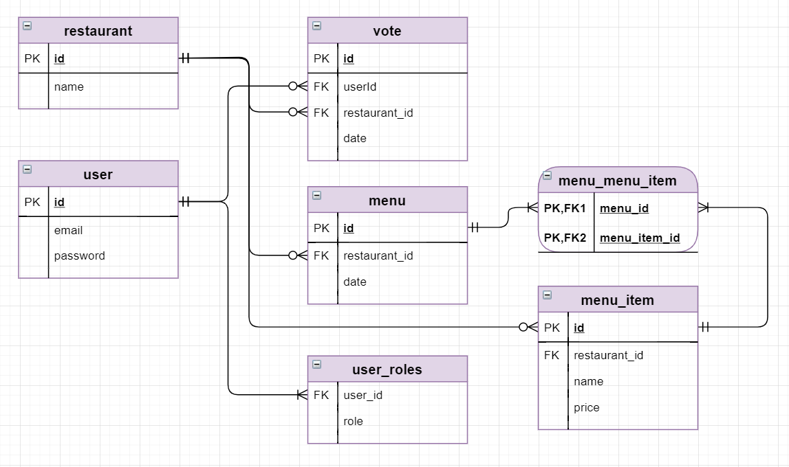

----
The task is:

Design and implement a REST API using Hibernate/Spring/SpringMVC (or Spring-Boot) **without frontend**.

Build a voting system for deciding where to have lunch.

 * 2 types of users: admin and regular users
 * Admin can input a restaurant and it's lunch menu of the day (2-5 items usually, just a dish name and price)
 * Menu changes each day (admins do the updates)
 * Users can vote on which restaurant they want to have lunch at
 * Only one vote counted per user
 * If user votes again the same day:
    - If it is before 11:00 we asume that he changed his mind.
    - If it is after 11:00 then it is too late, vote can't be changed

Each restaurant provides new menu each day.

----

   
### The Database Structure

### Resources accessibility: 
    
    Public resources:
    /rest/restaurants/** 
    /rest/profile/register
    
    Resources accessible for loged users:
    /rest/votes/**
    
    Resources accessible for loged admins:
    /rest/admin/**
    /rest/admin/restaurants/**
    /rest/admin/menus/**
    
    
#### Caching strategy
Get All Restaurants command is cached on the service level since it's public and presumably used most often. The command returns not the Restaurant entity object but the RestaurantTo, which includes fields of Restaurant entity and menu for today.  The cache gets evicted when an admin saves/updates/deletes a menu or restaurant. 

   
   
### Curl samples
> For windows use `Git Bash`

#### get all Restaurants
`curl -s http://localhost:8080/restaurantvoter/rest/restaurants`

#### get count of Votes for a day
`curl -s http://localhost:8080/restaurantvoter/rest/restaurants/100000/votecount?date=2020-08-22`

#### create Restaurant
`curl -s -X POST -d '{"name":"NewRestaurant"}' -H 'Content-Type:application/json;charset=UTF-8' http://localhost:8080/restaurantvoter/rest/admin/restaurants --user admin@mail.ru:admin`

#### delete Restaurant
`curl -s -X DELETE http://localhost:8080/restaurantvoter/rest/admin/restaurants/100000 --user admin@mail.ru:admin`

#### update Restaurant
`curl -s -X PUT -d '{"id": 100000,"name": "Тепло"}' -H 'Content-Type:application/json;charset=UTF-8' http://localhost:8080/restaurantvoter/rest/admin/restaurants/100000 --user admin@mail.ru:admin`

#### get all Votes owned by user
`curl -s http://localhost:8080/restaurantvoter/rest/votes --user user@mail.ru:user`

#### create Vote by User 
`curl -s -X POST -d '{"restaurantId": 100001}' -H 'Content-Type:application/json;charset=UTF-8' http://localhost:8080/restaurantvoter/rest/votes --user user@mail.ru:user`

#### update Vote by User 
`curl -s -X PUT -d '{"restaurantId": 100000}' -H 'Content-Type:application/json;charset=UTF-8' http://localhost:8080/restaurantvoter/rest/votes --user user@mail.ru:user`

#### get all Menus
`curl -s http://localhost:8080/restaurantvoter/rest/admin/menus --user admin@mail.ru:admin`

#### get Menu for today
`curl -s http://localhost:8080/restaurantvoter/rest/admin/menus/today?restaurantId=100000 --user admin@mail.ru:admin`

#### save Menu for today
`curl -s -X POST -d '{"restaurantId": 100000, "menuItems":[{"name": "Макароны с сыром", "price": 690},{"name": "Салат Брут","price": 1250}]}' -H 'Content-Type:application/json;charset=UTF-8' http://localhost:8080/restaurantvoter/rest/admin/menus/today --user admin@mail.ru:admin`

For testing purpose there is also SoapUI test project in the root of the repository.